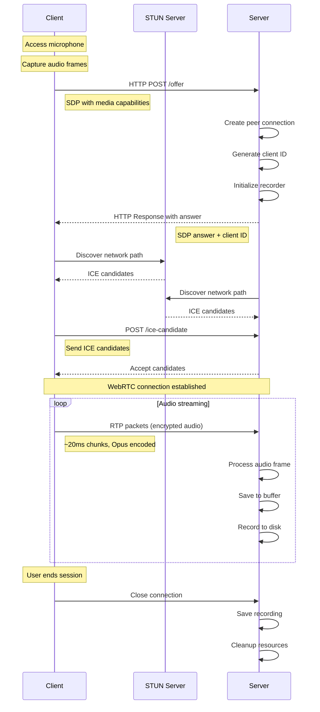

# Real-Time Audio Streaming: Data Flow Documentation

## Overview

This document explains how audio data flows from a user's microphone to the server in our WebRTC-based real-time streaming system.

## Complete Data Flow

### 1. Audio Capture (Client Side)
- **Microphone Access**: The system uses PyAudio to access the local microphone
- **Sampling**: Audio is continuously sampled at 48kHz (by default) in 16-bit format
- **Buffer Creation**: Raw audio data is collected in frames of 960 samples
- **Queue Management**: Captured frames are added to an async queue for processing

### 2. WebRTC Processing (Client Side)
- **Media Track Creation**: Audio is wrapped in a `PyAudioStreamTrack` that implements the WebRTC MediaStreamTrack interface
- **Packetization**: The `recv()` method converts raw audio data to WebRTC-compatible frames
- **Encoding**: Audio is automatically encoded (typically using Opus codec) by the WebRTC stack
- **Encryption**: DTLS-SRTP encrypts the media for secure transmission

### 3. Connection Establishment
- **Signaling**: 
  - Client creates an "offer" with its capabilities
  - Server responds with an "answer"
  - This exchange uses HTTPS via the `/offer` endpoint
- **ICE Candidates**: 
  - Both sides discover network paths using STUN servers
  - Candidates are exchanged via the `/ice-candidate` endpoint
  - The best connection path is selected

### 4. Network Transport
- **RTP Protocol**: Audio packets are transmitted using RTP (Real-time Transport Protocol)
- **NAT Traversal**: ICE, STUN, and potentially TURN servers help establish direct connections
- **Packet Delivery**: Small audio chunks are continuously sent with timing information
- **Latency Handling**: Packets are prioritized for minimal delay rather than guaranteed delivery

### 5. Server-Side Processing
- **Packet Reception**: The server receives encrypted RTP packets
- **Decryption**: DTLS-SRTP decrypts the audio data
- **Decoding**: The audio is decoded from the transmission format (e.g., Opus)
- **Frame Processing**: `AudioTrackProcessor` processes each received frame
- **Format Detection**: The server analyzes and adapts to the incoming audio format
- **Audio Extraction**: Audio data is extracted using the appropriate method based on the frame type

### 6. Storage and Handling (Server Side)
- **In-Memory Buffer**: Processed audio frames are stored in memory
- **Recording**: The audio is saved to disk in WAV format
- **Format Preservation**: The detected format parameters (rate, channels, bit depth) are maintained
- **Cleanup**: Resources are properly released when connections end

## Key Technologies

- **WebRTC**: The overall framework for real-time communication
- **RTP/SRTP**: Protocols for transmitting real-time media packets
- **ICE/STUN/TURN**: NAT traversal technologies for establishing peer connections
- **PyAudio**: Library for accessing audio hardware
- **aiortc**: Python implementation of WebRTC
- **asyncio**: Asynchronous programming framework for handling concurrent operations

## Sequence Diagram

## Connection Maintenance

- **Heartbeats**: WebRTC connections send periodic checks to ensure the link is active
- **Reconnection**: Temporary disconnections trigger reconnection attempts
- **Inactivity Timeouts**: Connections are closed after 30 seconds of inactivity
- **Cleanup**: Resources are properly released when connections end

This comprehensive flow enables low-latency, secure audio streaming from the client microphone to server processing with minimal delay and robust error handling. 